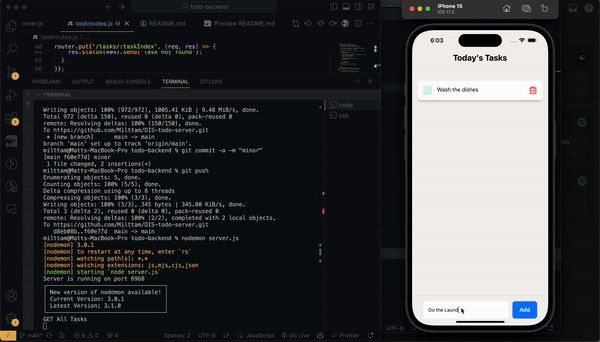

# Todo-App Backend Server

This is a backend server for a todo app. It is built using Node.js and Express.js

Frontend Server link: https://github.com/Milttam/DIS-todo-mobile

## Demo



## Pre-requisites

- Node.js
- Express.js
- nodemon

## Running

```
nodemon server.js
```

Note: You may need to kill the port of the server if it is already running. You can do this by running the following command:

```
npx kill-port 6968
```

## Functionality

The server has the following endpoints and some example usage:

### GET /

```
const getData = async () => {
      const res = await fetch(`http://localhost:6968/api/`, {
        method: "GET",
      });
      const data = await res.json();

      // Custom actions
    }
```

### POST /tasks

Note: The body must have the attribute "taskName" to pass a name for the task.

```
const addTask = async () => {
      const res = await fetch(`http://localhost:6968/api/tasks`, {
        method: "POST",
        headers: { "Content-type": "Application/json"},
        body: JSON.stringify({taskName: task.text}),
      });
      const data = await res.json();

      // Custom actions
    }
```

### PUT /tasks/:taskIndex

Note: The body must have the attribute "newTitle" to pass a new title for the task and "updateCheck" to pass a boolean value to update the check status of the task.

```
const checkTask = async () => {
      const res = await fetch(`http://localhost:6968/api/tasks/${index}`, {
        method: "PUT",
        headers: { "Content-type": "Application/json"},
        body: JSON.stringify({newTitle: text, updateCheck: true}),
      });
      const data = await res.json();

      // Custom actions
    }
```

### DELETE /tasks/:taskIndex

Note: The request must send the index of the task to be deleted. as defined

```
const deleteTask = async () => {
      const res = await fetch(`http://localhost:6968/api/tasks/${index}`, {
        method: "DELETE",
        headers: { "Content-type": "Application/json"},
      });
      const data = await res.json();

      // Custom actions
    }
```
